# 代表イベント一覧

new-cursor のイベント駆動アーキテクチャで扱う代表イベントのカタログ。実装の JSON スキーマは別途定義する。合意の背景は [AGREEMENTS.md](./AGREEMENTS.md) を参照。

## ドメインイベント

司令室（apps/web）がタスク・実行記録の状態変化を表す。トランザクション内で outbox に書き、relay が SQS 経由で Worker へ届ける。ES/CQRS の記録対象は task と run のみ。

- `task.created` — 司令官チャットまたは API でタスクを起票する。`background`・`verificationItems` を task 行へ永続化する。子タスク（エスカレーション）も同イベントで `parentTaskId` を付与して起票する。
- `task.worktree.requested` — 起票完了後、Worker に worktree とブランチの作成を依頼する。
- `task.worktree.ready` — Worker が worktree 作成を完了し、実装工程へ進める。
- `task.stage.changed` — MVP の 6 stage（`created` → `worktree_requested` → `worktree_ready` → `queued` → `implementing` → `completed`）の遷移を記録し、購読エージェントへルーティングする。PR マージ等の拡張 stage は将来追加予定。
- `task.queued` — 同一 repo+branch の競合により直列待ちに入る。
- `run.started` — Worker が Local Cursor SDK で worktree を cwd として 1 run（1 SDK 呼び出し）を開始する。
- `run.completed` — 1 run が完了し、司令室が次工程または完了判定を行う。UI タイムラインではエージェント名・トークン消費を表示する。
- `task.waiting` — 承認・CI・マージ・子タスク完了など外部きっかけを待機する。
- `task.resumed` — 待機条件が満たされ、中断前の工程から再開する。
- `task.pr.requested` — 実装・検証完了後、Worker にコミットと PR 作成を依頼する。
- `task.pr.created` — PR 作成完了。検証工程へ進めるか承認待ちにする。
- `task.completed` — 承認・PR マージ・検証 OK など完了条件を満たし、タスクをクローズする。
- `task.failed` — 回復不能な失敗を記録し、エスカレーションまたは手動対応へ誘導する。
- `task.escalation.requested` — 親タスクをブロックし、問題用の子タスクを起票する。
- `task.escalation.resolved` — 子タスク完了を検知し、親タスクの待機を解除する。
- `approval.requested` — 検証工程で人間確認が必要なとき、UI または Slack に承認を求める。
- `approval.granted` — 承認完了。PR auto-merge または完了判定へ進める。
- `approval.rejected` — 却下。実装工程へ戻すか、待機・失敗にする。
- `pr.merge.requested` — 承認後の auto-merge を Worker または GitHub 連携へ依頼する。
- `pr.merged` — GitHub Webhook 由来の PR マージ完了。タスク完了または競合キュー解放へ進める。
- `ci.started` — GitHub Webhook 由来の CI 開始を記録する。
- `ci.completed` — CI 結果（success / failure）をタスク状態に反映し、次工程を決める。
- `branch.conflict.detected` — ブランチ競合を検知し、解消依頼または直列キュー待ちにする。
- `branch.conflict.resolved` — コンフリクト解消完了。実装・検証を再開する。
- `repository.registered` — リポジトリを登録する。外部 repo なら clone（`repository.clone.*`）を起動し、完了後にタスク起票を受け付ける。
- `cron.tick` — cron 式に従い定期ジョブ定義を評価する。
- `cron.job.triggered` — 定期ジョブ（セキュリティ診断・パフォーマンス診断・リファクタ提案など）を起動し、タスク起票または run 追加する。

## 典型フロー

```mermaid
flowchart LR
  A[task.created] --> B[task.worktree.requested]
  B --> C[task.worktree.ready]
  C --> D[task.stage.changed]
  D --> E[run.started]
  E --> F[run.completed]
  F --> G{次工程}
  G -->|実装継続| D
  G -->|PR| H[task.pr.requested]
  H --> I[task.pr.created]
  I --> J[ci.started]
  J --> K[ci.completed]
  K --> L[approval.requested]
  L --> M[approval.granted]
  M --> N[pr.merge.requested]
  N --> O[pr.merged]
  O --> P[task.completed]
```

- 起票 → worktree → 実装 run → PR → CI → 承認 → auto-merge → 完了が基本経路。
- 競合時は `task.queued`、外部待ちは `task.waiting` → `task.resumed`、ブロック時は `task.escalation.requested` → 子 `task.created` → `task.escalation.resolved`。

## 付録

### イベントの種類

- **ドメインイベント** — 司令室が outbox に書く状態変化。上記一覧が該当する。
- **SQS 配送メッセージ** — relay が outbox を ElasticMQ へ publish するラップ形式。Worker が inbox で冪等受信する。
- **外部 Webhook** — GitHub・Slack などから届く事実。司令室がドメインイベントへ変換して outbox に書く。

### イベントフロー（汎用オートメーション）

固定工程を横断する連鎖。MVP は DB スキーマと oRPC CRUD のみ（UI は後回し）。

- `eventflow.definition.saved` — フロー定義（トリガー・アクション・emitEvents）を DB に保存する。
- `eventflow.trigger.matched` — ドメインイベントまたは Webhook 受信時にトリガー条件が一致した。
- `eventflow.action.completed` — アクション完了後、定義どおりの次イベントを outbox に書く。

### Outbox / Inbox（配送層）

- `outbox.written` — 司令室 DB トランザクション内でドメインイベントを永続化する。
- `outbox.relayed` — relay が ElasticMQ への publish に成功した。
- `inbox.received` — Worker が SQS から受信し、`eventId` で冪等チェックを開始する。
- `inbox.processed` — 処理成功。inbox を完了にし、SQS メッセージを削除する。
- `inbox.duplicate.skipped` — 同一 `eventId` の再配送を副作用なくスキップする。

### 定期実行・自己改善

- `cron.rule_improvement.triggered` — 実行記録を集計し、ルール候補の見直しタスクを起動する。

### 代表ペイロードキー

| イベント | 主なキー |
| --- | --- |
| `task.created` | `taskId`, `repositoryId`, `title`, `branchName`, `background`, `verificationItems`, `parentTaskId`（子のみ） |
| `task.stage.changed` | `taskId`, `fromStage`, `toStage` |
| `run.started` / `run.completed` | `taskId`, `runId`, `agentId`, `stage`, `summary` |
| `task.waiting` / `task.resumed` | `taskId`, `waitingFor` / `resumeReason` |
| `approval.*` | `taskId`, `approvedBy` / `rejectedBy`, `pullRequestUrl` |
| `ci.completed` | `taskId`, `status`, `checkRuns` |
| `repository.registered` | `repositoryId`, `remoteUrl`, `isExternal` |

### 購読ルーティングと UI

- エージェントごとに購読するイベント種別とフィルタを設定し、条件一致時に SQS で 1 件ずつ届ける。購読は処理候補の設定であり、タスクへの固定担当割当ではない。
- タスクリストの「最後のイベント」は親タスクのドメインイベント要約を表示する。
- タスク詳細の統合タイムラインはドメインイベント・run・子タスク起票を時系列で混在表示する。run 行にエージェント名・トークンを出す。
- 意思決定リストはドメインイベントからは組み立てず、`task_decisions` テーブル（`decisions.create` / `record_decision`）を表示する。詳細は [UI.md](./UI.md) と [AGREEMENTS.md](./AGREEMENTS.md)。
